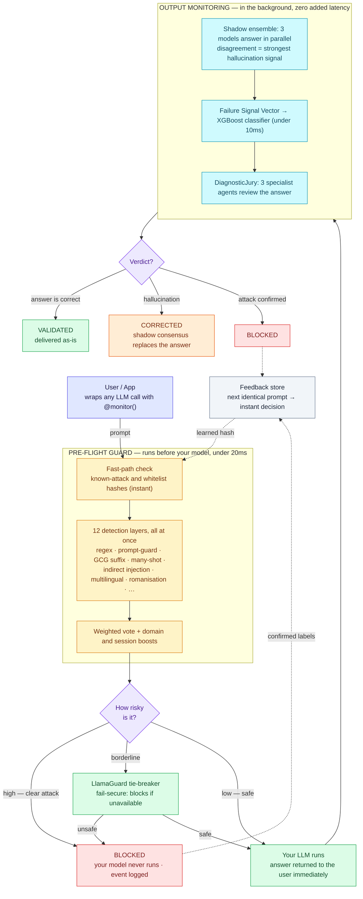

# FIE Architecture Diagram

This is the canonical architecture diagram (v1.13.0). It renders automatically on
GitHub. To export a PNG for a paper or slide deck, paste the Mermaid block below
into [mermaid.live](https://mermaid.live) → **Actions → PNG**.

## What each colour means

| Colour | Meaning |
|--------|---------|
| Blue   | The incoming user request |
| Amber  | The pre-flight guard (12 detection layers, before the model) |
| Purple | A decision / routing point |
| Red    | Request blocked — the model never runs, or the answer is suppressed |
| Green  | The safe path: your LLM and a validated answer |
| Cyan   | Background hallucination monitoring (shadow ensemble, XGBoost, jury) |
| Orange | A corrected answer (shadow consensus) |
| Grey   | The learning loop — confirmed labels become instant future decisions |

For the full, animated, every-component view, open
[`fie_architecture.html`](fie_architecture.html) in a browser, or read
[`ARCHITECTURE.md`](ARCHITECTURE.md).
