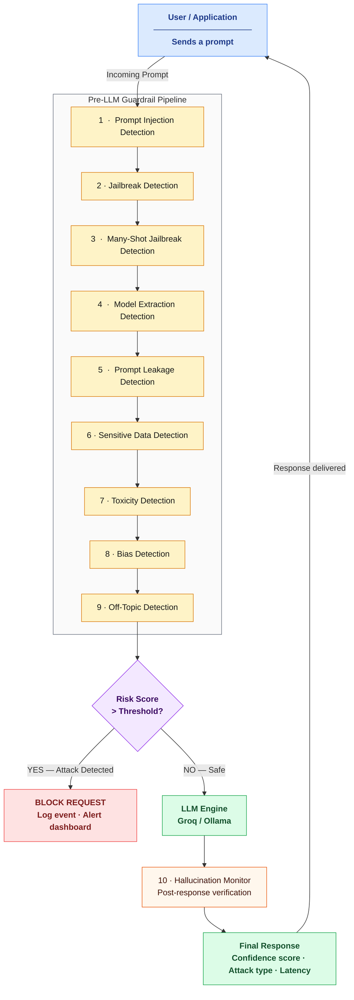

# FIE Architecture Diagram

Paste the Mermaid code below at **https://mermaid.live** → click **Actions → PNG** → save as `fig_architecture.png`

## What each colour means

| Colour | Meaning |
|--------|---------|
| Blue   | User / Application |
| Yellow | Detection layers (pre-LLM) |
| Purple | Decision gate |
| Red    | Attack blocked |
| Green  | Safe path — LLM + final output |
| Orange | Hallucination monitor |
