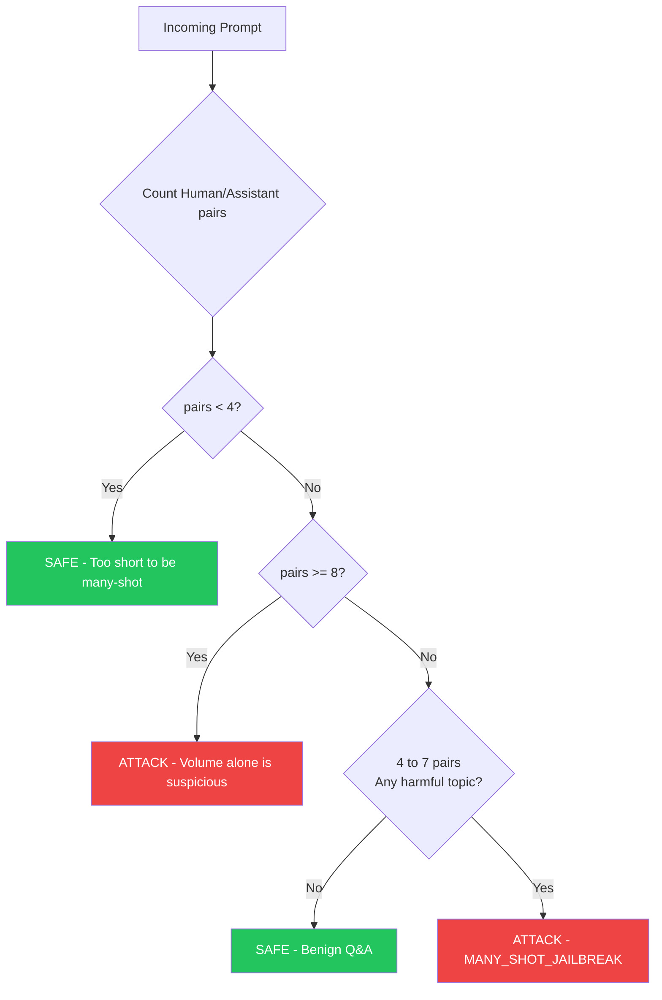

# Many-Shot Jailbreak Detection — Diagram

Use this Mermaid diagram to generate the PNG for the article header area.

## Header Image Generation Prompt

Use this prompt in **Midjourney**, **DALL-E 3**, or **Ideogram**:

---

**Prompt:**

> A dark-themed digital illustration showing a conversation chat interface. The first few messages are green and innocent — geography questions, coding questions. Then gradually the messages turn red and sinister, ending with a dangerous request at the bottom. A glowing red shield icon intercepts the final message. Clean, minimal, tech aesthetic. No text in the image. 16:9 aspect ratio.

---

**Alternative (simpler) prompt for DALL-E:**

> Abstract visualization of a jailbreak attack: a sequence of blue harmless chat bubbles followed by one red dangerous bubble, with a security shield blocking it. Dark background, neon glow effect, cybersecurity aesthetic.
